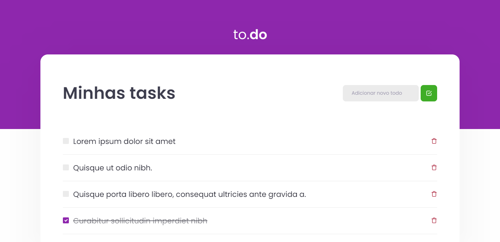

<h3 align="center">
  to.do
</h3>

<blockquote align="center">Win challenges, earn points and level up!</blockquote>

  

  

  

  <a href="#rocket-about-the-app">About the app</a>&nbsp;&nbsp;&nbsp;|&nbsp;&nbsp;&nbsp;
  <a href="#memo-license">License</a>

## :memo: How to use?

- **`git clone https://github.com/Juliamello8/ignite-desafio1.git`**
- **`yarn or npm install`**
- **`yarn dev`**
- **`😄 enjoy 😄`**

## :rocket: About the app

It is a simple project to create tasks. It was developed to put my knowledge about ReactJS, components and states into practice. Challenge launched by Rocketseat on the ignite trail of ReactJS.

## :memo: Technologies

- :memo: **`NextJS`**
- :memo: **`Sass`**
- :memo: **`Typescript`**

### Features

- **`Create Tasks`**: Field to type the description of the task and button to create it.

- **`Completed Tasks`**: Field for selecting completed tasks.

- **`Delete Tasks`**: If the task has already been completed and you will no longer need it, you can select the trash to delete it.

### Demo

- **`Dashboard`**

  

## :memo: License

This project use a MIT license. See the file [LICENSE](LICENSE) to more details.

---

Done with affection 💜 by Julia Mello :wave: